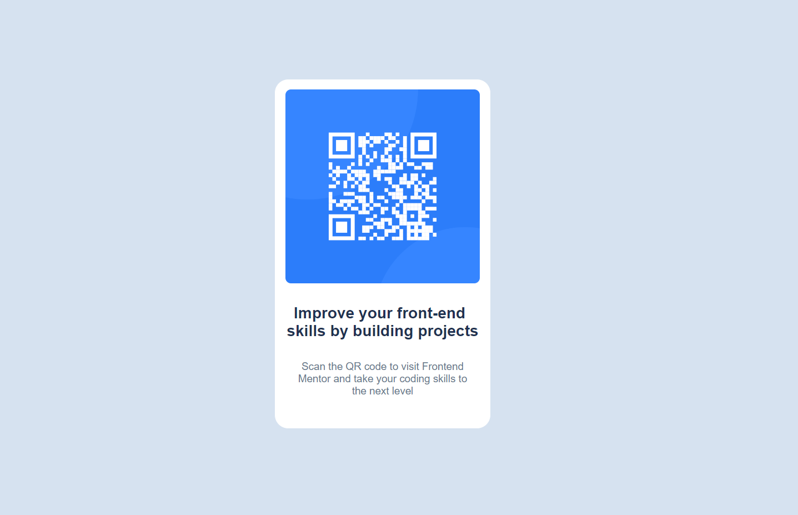

# Frontend Mentor - QR code component solution

This is a solution to the [QR code component challenge on Frontend Mentor](https://www.frontendmentor.io/challenges/qr-code-component-iux_sIO_H). Frontend Mentor challenges help you improve your coding skills by building realistic projects. 

## Table of contents

- [Overview](#overview)
  - [Screenshot](#screenshot)
  - [Links](#links)
- [My process](#my-process)
  - [Built with](#built-with)
  - [What I learned](#what-i-learned)
  - [Continued development](#continued-development)
- [Author](#author)

## Overview

### Screenshot



### Links

- Github URL: [Add solution URL here](https://your-solution-url.com)
- Live Site URL: [Add live site URL here](https://your-live-site-url.com)

## My process

### Built with

- Semantic HTML5 markup
- CSS custom properties
- Flexbox
- CSS Grid
- Mobile-first workflow

### What I learned

This challenge allows me to know how to constraint content width to a certain range and improve my knowledge about responsive design.

```css
main {
    max-width: -moz-fit-content;
    max-width: fit-content;
}

@media only screen and (min-width: 320px) and (max-width: 1440px){
    main{
        display: flex;
        flex-direction: column;
    }
}
```

### Continued development

I still have a lot to learn about responsive design because it took me too much time in this project.

## Author

- Github - [Allcodln](https://github.com/AllcodIn)
- Frontend Mentor - [@Allcodln](https://www.frontendmentor.io/profile/AllcodIn)
